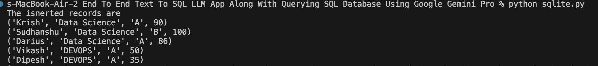
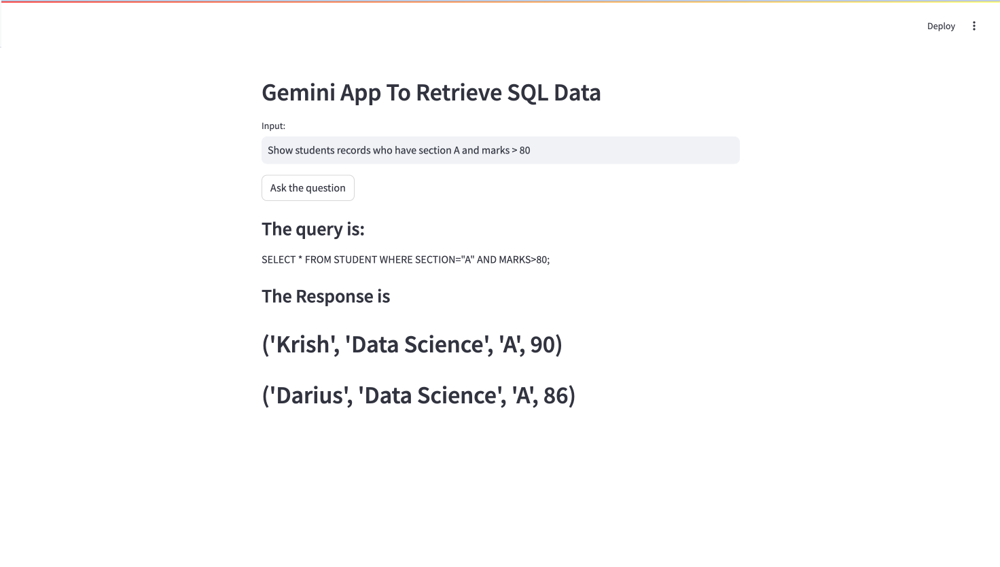
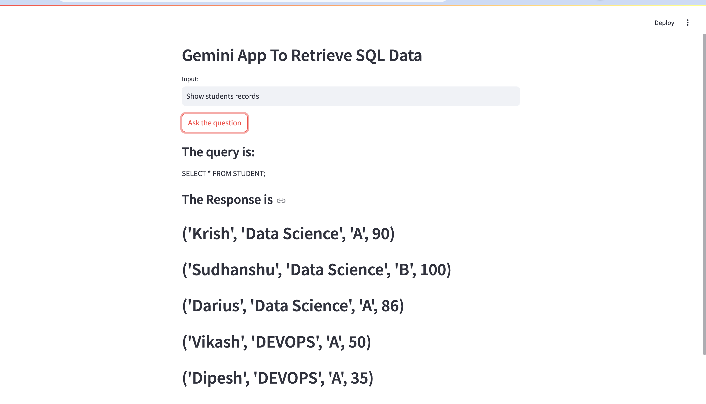

# Gemini App to Retrieve SQL Data given Text

## Project Description

### Overview
The Gemini App is a Streamlit-based web application designed to seamlessly convert natural language questions into SQL queries and execute them against a SQLite database. This innovative application leverages Google Generative AI to interpret user input and generate precise SQL queries, making database interactions more intuitive and accessible.

### Technologies Used
- **Python**: The core programming language for the application.
- **Streamlit**: A web application framework used to build and deploy the interactive front-end.
- **SQLite**: A lightweight, disk-based database for storing and managing student data.
- **Google Generative AI**: Employed to convert natural language questions into SQL queries.
- **dotenv**: Utilized for loading environment variables securely from a `.env` file.

### Key Functionalities

1. **Environment Setup**:
   - The application begins by loading environment variables using the `dotenv` library. This includes securely managing API keys and other sensitive information.

2. **Google Generative AI Configuration**:
   - Configuring Google Generative AI with an API key from the environment variables allows the application to generate SQL queries from natural language input.

3. **Natural Language to SQL Conversion**:
   - The application features a function that interacts with Google Generative AI, converting user questions into corresponding SQL queries using a predefined prompt.

4. **SQL Query Execution**:
   - The generated SQL queries are executed against the SQLite database. The results are then fetched and displayed within the application.

5. **Streamlit Interface**:
   - The web interface, built using Streamlit, includes:
     - A header displaying the app title.
     - A text input field for users to enter their questions.
     - A submit button to process the question and retrieve results.
   - Upon submission, the generated SQL query is displayed, executed, and the results are shown in a user-friendly format.

6. **Database Initialization**:
   - The application sets up the SQLite database by creating a `STUDENT` table with columns for `NAME`, `CLASS`, `SECTION`, and `MARKS`.
   - Several sample records are inserted into the table to demonstrate the app's querying capabilities.

7. **Data Display**:
   - The inserted records are displayed in the console to verify successful data insertion and to illustrate the app's functionality.

### User Interaction
Users interact with the Streamlit interface by inputting natural language questions. The application then:
1. Converts the question into an SQL query using Google Generative AI.
2. Displays the generated SQL query.
3. Executes the query against the SQLite database.
4. Displays the results on the web interface.

### Benefits
This project highlights the seamless integration of natural language processing with SQL databases, providing an intuitive interface for database interactions. Users can query the database without needing SQL knowledge, enhancing accessibility and usability.

## Setup Instructions

### Step 1: Setup a virtual environment to run the application
```bash
conda create -p venv python==3.10 -y
conda activate venv
```

### Step 2: Download required packages from requirements.txt
```bash
pip install -r requirements.txt
```

### Step 3: Complete the Database code that is in 'sqlite.py' and run it
```bash
python sql.py
```


### Step 4: Run the 'app.py'
```bash
streamlit run app.py
```




